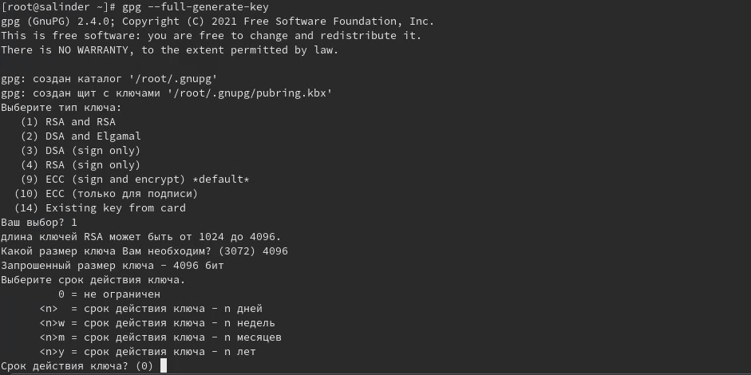
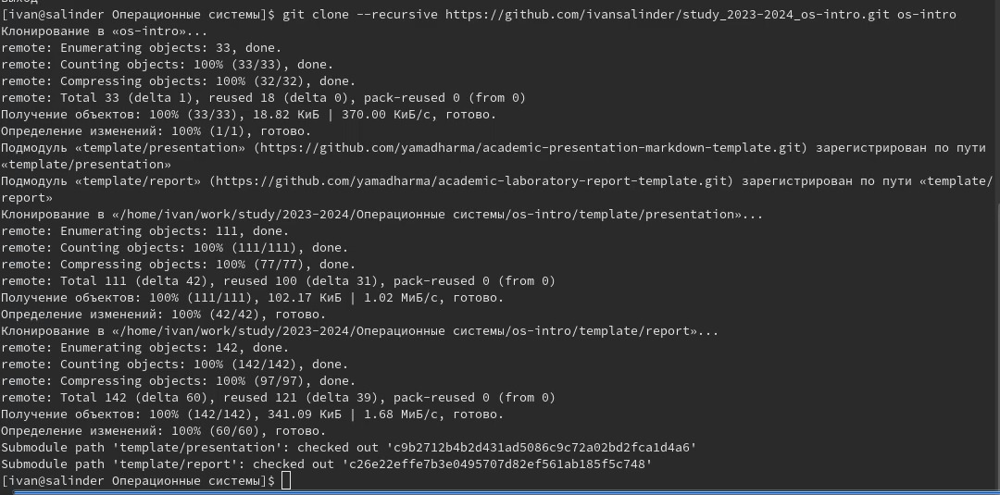

---
## Front matter
title: "ОТЧЕТ ПО ЛАБОРАТОРНОЙ РАБОТЕ №2"
subtitle: "Отчет"
author: "Иван Борисович Салиндер"

## Generic otions
lang: ru-RU
toc-title: "Содержание"

## Bibliography
bibliography: bib/cite.bib
csl: pandoc/csl/gost-r-7-0-5-2008-numeric.csl

## Pdf output format
toc: true # Table of contents
toc-depth: 2
lof: true # List of figures
lot: true # List of tables
fontsize: 12pt
linestretch: 1.5
papersize: a4
documentclass: scrreprt
## I18n polyglossia
polyglossia-lang:
  name: russian
  options:
	- spelling=modern
	- babelshorthands=true
polyglossia-otherlangs:
  name: english
## I18n babel
babel-lang: russian
babel-otherlangs: english
## Fonts
mainfont: IBM Plex Serif
romanfont: IBM Plex Serif
sansfont: IBM Plex Sans
monofont: IBM Plex Mono
mathfont: STIX Two Math
mainfontoptions: Ligatures=Common,Ligatures=TeX,Scale=0.94
romanfontoptions: Ligatures=Common,Ligatures=TeX,Scale=0.94
sansfontoptions: Ligatures=Common,Ligatures=TeX,Scale=MatchLowercase,Scale=0.94
monofontoptions: Scale=MatchLowercase,Scale=0.94,FakeStretch=0.9
mathfontoptions:
## Biblatex
biblatex: true
biblio-style: "gost-numeric"
biblatexoptions:
  - parentracker=true
  - backend=biber
  - hyperref=auto
  - language=auto
  - autolang=other*
  - citestyle=gost-numeric
## Pandoc-crossref LaTeX customization
figureTitle: "Рис."
tableTitle: "Таблица"
listingTitle: "Листинг"
lofTitle: "Список иллюстраций"
lotTitle: "Список таблиц"
lolTitle: "Листинги"
## Misc options
indent: true
header-includes:
  - \usepackage{indentfirst}
  - \usepackage{float} # keep figures where there are in the text
  - \floatplacement{figure}{H} # keep figures where there are in the text
---

# Цель работы

Изучить идеологию и применение средств контроля версий
Освоить умения по работе с gift

# Задание
Создать базовую конфигурацию для работы с git.
Создать ключ SSH
Создать ключ PGP
Настроить подписи git
Зарегистрироваться на Github
Создать локальный каталог по выполнению заданий по предмету

# Теоретическое введение
Системы контроля версий. Общие понятия

Системы контроля версий (Version Control System, VCS) применяются при работе нескольких человек над одним проектом. Обычно основное дерево проекта хранится в локальном или удалённом репозитории, к которому настроен доступ для участников проекта. При внесении изменений в содержание проекта система контроля версий позволяет их фиксировать, совмещать изменения, произведённые разными участниками проекта, производить откат к любой более ранней версии проекта, если это требуется.

В классических системах контроля версий используется централизованная модель, предполагающая наличие единого репозитория для хранения файлов. Выполнение большинства функций по управлению версиями осуществляется специальным сервером. Участник проекта (пользователь) перед началом работы посредством определённых команд получает нужную ему версию файлов. После внесения изменений, пользователь размещает новую версию в хранилище. При этом предыдущие версии не удаляются из центрального хранилища и к ним можно вернуться в любой момент. Сервер может сохранять не полную версию изменённых файлов, а производить так называемую дельта-компрессию — сохранять только изменения между последовательными версиями, что позволяет уменьшить объём хранимых данных.

Системы контроля версий поддерживают возможность отслеживания и разрешения конфликтов, которые могут возникнуть при работе нескольких человек над одним файлом. Можно объединить (слить) изменения, сделанные разными участниками (автоматически или вручную), вручную выбрать нужную версию, отменить изменения вовсе или заблокировать файлы для изменения. В зависимости от настроек блокировка не позволяет другим пользователям получить рабочую копию или препятствует изменению рабочей копии файла средствами файловой системы ОС, обеспечивая таким образом, привилегированный доступ только одному пользователю, работающему с файлом.

Системы контроля версий также могут обеспечивать дополнительные, более гибкие функциональные возможности. Например, они могут поддерживать работу с несколькими версиями одного файла, сохраняя общую историю изменений до точки ветвления версий и собственные истории изменений каждой ветви. Кроме того, обычно доступна информация о том, кто из участников, когда и какие изменения вносил. Обычно такого рода информация хранится в журнале изменений, доступ к которому можно ограничить.

В отличие от классических, в распределённых системах контроля версий центральный репозиторий не является обязательным.

Среди классических VCS наиболее известны CVS, Subversion, а среди распределённых — Git, Bazaar, Mercurial. Принципы их работы схожи, отличаются они в основном синтаксисом используемых в работе команд.

Примеры использования git

Система контроля версий Git представляет собой набор программ командной строки. Доступ к ним можно получить из терминала посредством ввода команды git с различными опциями.
Благодаря тому, что Git является распределённой системой контроля версий, резервную копию локального хранилища можно сделать простым копированием или архивацией.
Основные команды git
Перечислим наиболее часто используемые команды git.
Создание основного дерева репозитория:
git init
Получение обновлений (изменений) текущего дерева из центрального репозитория:

git pull
Отправка всех произведённых изменений локального дерева в центральный репозиторий:

git push
Просмотр списка изменённых файлов в текущей директории:
git status
Просмотр текущих изменений:

git diff
Сохранение текущих изменений:
добавить все изменённые и/или созданные файлы и/или каталоги:
git add .
добавить конкретные изменённые и/или созданные файлы и/или каталоги:
git add имена_файлов
удалить файл и/или каталог из индекса репозитория (при этом файл и/или каталог остаётся в локальной директории):
git rm имена_файлов
Сохранение добавленных изменений:
сохранить все добавленные изменения и все изменённые файлы:
git commit -am 'Описание коммита'
сохранить добавленные изменения с внесением комментария через встроенный редактор:
git commit
создание новой ветки, базирующейся на текущей:
git checkout -b имя_ветки
переключение на некоторую ветку:
git checkout имя_ветки
(при переключении на ветку, которой ещё нет в локальном репозитории, она будет создана и связана с удалённой)
отправка изменений конкретной ветки в центральный репозиторий:

git push origin имя_ветки
слияние ветки с текущим деревом:

git merge --no-ff имя_ветки
Удаление ветки:
удаление локальной уже слитой с основным деревом ветки:
git branch -d имя_ветки
принудительное удаление локальной ветки:
git branch -D имя_ветки
удаление ветки с центрального репозитория:
git push origin :имя_ветки

Стандартные процедуры работы при наличии центрального репозитория
Работа пользователя со своей веткой начинается с проверки и получения изменений из центрального репозитория (при этом в локальное дерево до начала этой процедуры не должно было вноситься изменений):
git checkout master
git pull
git checkout -b имя_ветки

Затем можно вносить изменения в локальном дереве и/или ветке.
После завершения внесения какого-то изменения в файлы и/или каталоги проекта необходимо разместить их в центральном репозитории. Для этого необходимо проверить, какие файлы изменились к текущему моменту:
git status
При необходимости удаляем лишние файлы, которые не хотим отправлять в центральный репозиторий.
Затем полезно просмотреть текст изменений на предмет соответствия правилам ведения чистых коммитов:
git diff

Если какие-либо файлы не должны попасть в коммит, то помечаем только те файлы, изменения которых нужно сохранить. Для этого используем команды добавления и/или удаления с нужными опциями:

    git add …  
    git rm …
Если нужно сохранить все изменения в текущем каталоге, то используем:

git add .
Затем сохраняем изменения, поясняя, что было сделано:
git commit -am "Some commit message"
Отправляем изменения в центральный репозиторий:
git push origin имя_ветки
или
git push

# Выполнение лабораторной работы

## Установка программного обеспечения

Устанавливаю необходимое программное обеспечение git и gh через терминал с помощью команд: dnf install git и dnf install gh (рис.)

{#fig:001 width=70%}

## Базовая настройка git

Задаю в качестве имени и email владельца репозитория свое имя, фамилию и электронную почту (рис.).

{#fig:002 width=70%}

Настраиваю utf-8 в выводе сообщений git для их корректного изображения (рис.).

{#fig:003 width=70%}

Начальной ветке задаю имя master (рис.)

{#fig:004 width=70%}

Задаю параметры autocrlf и safecrlf для корректного отображения конца строки (рис.)

{#fig:005 width=70%}

## Cоздание ключа SSH

Задаю ключ ssh размером 4096 бит по алгоритму rsa (рис)

{#fig:006 width=70%}

Создаю ключ ssh по алгоритму ed25519 (рис)

{#fig.007 width=70%}

## Создание ключа PGP

Генерирую ключ PGP, затем выбираю тип ключа RSA and RSA, задаю максимальную длину ключа 4096, оставляю неограниченный срок действия ключа. (рис.)

{#fig:008 width=70%}

## Регистрация на Github

У меня уже был создан на Github, соответственно, настройки аккаунта я также заполнил. Поэтому я просто вхожу в свой аккаунт (рис.)

{#fig:009 width=70%}

## Добавление PGP на Github

Вывожу список отпечаток ключа в терминал, ищу в результате запроса отпечаток ключа (последовательность байтов для идентификации более длинного ключа), он сттоит после знака слева. Копирую его в буфер обмена (рис)

{#fig:010 width=70%}

Ввожу в терминал команду, с помощью которой копирую сам ключ PGP в буфер обмена, за это отвечает утилита xclip (рис.)

{#fig:011 width=70%}

Открываю настройки Github, среди них находим добавление GPG ключа (рис.)

{#fig.012 width=70%}

Нажимаю на "New GPG key" и вставляю в поле ключ из буфера обмена (рис. )

{#fig:013 width=70%}

Добавляю ключ GPG на Github (рис. @fig.013) (рис.)

{#fig:014 width=70%}

## Подписывание коммитов git и настройка подписей git

Настраиваю автоматические подписи комитов git: используя введенный ранее email, указываю git использовать его при создании подписей комитов (рис.)

{#fig:015 width=70%}

## Авторизация в gh

Начинаю авторизацию в gh, отвечаю на наводящие вопросы от утилиты, в конце выбираю авторизоваться через браузер (рис.)

{#fig:016 width=70%}

Завершаю авторизацию на сайте (рис.)

{#fig:017 width=70%}

## Создание локального репозитория

Сначала создаю директорию с помощью утилиты mkdir и флага -р, который позволяет установить каталоги на всем указанном пути. После этого перехожу в созданную директорию и создаю репозиторий с помощью команды gh repo (рис.)

{#fig:018 width=70%}

После клонирую репозиторий к себе в директорию. Копирую с протоколом https, а не ssh, потому что при авторизации в при авторизации в gh выбрал протокол https (рис.)

{#fig:019 width=70%}

Удаляю лишние файлы с помощью утилиты rm и создаю каталоги (рис.)

{#fig:020 width=70%}

Добавляю все новые файлы для отправки на сервер (рис.)

{#fig:021 width=70%}

Отправляю файлы на сервер (рис.)

{#fig:022 width=70%}

# Выводы

При выполнении данной лабораторной работы я изучил идеологию и применение средств контроля версий. Усвоил умение по работе с git

# Ответы на контрольные вопросы
1. Системы контроля версий - программное обеспечение для облегчения работы с изменяющейся информацией. Они позволяют хранить несколько версий изменяющейся информации, одного и того же документа, может предоставить доступ к более ранним версиям документа. Используется для работы нескольких человек над проектом, позволяет посмотреть, кто и когда внес какие-либо изменения и тд.
VCS применяются для : хранения полной истории изменений, сохранения причин всех изменений, поиска причин изменений и совершивших изменения. Также для совместной работы над проектами
2. Хранилище - репозиторий, хранилище версий, в нем хранятся все документы, в том числе история изменений и прочая служебная информация. Commit - отслеживание изменений, сохраняет разницу в изменениях. История - хранит все изменения в проекте и при необходимости позволяет вернуться/обратиться к нужным данным. Рабочая копия - копия проекта, основанная на версии из хранилища, обычно самая последняя версия
3. Централизованная VCS (например CVS, TFS, AccuRev) - одно основное хранилище всего проекта. Каждый пользователь копирует себе необходимые файлы из этого репозитория, изменяет, затем добавляет к себе в хранилище. Децентрализованные VCS (Git, Bazaar) - у каждого пользователя свой вариант репозитория, есть возможность добавлять и забирать изменения из любого репозитория. В отличие от классических, в распределенных системах контроля версий центральных репозиторий не является обязательным
4. Сначала создается и подключается удаленный репозиторий, затем по мере изменения проекта эти изменения отправляются на сервер.
5. Участник проекта перед началом работы получает нужную ему версию проекта в хранилище с помощью определенных команд, после внесения изменений пользователь размешает новую версию в хранилище. При этом предыдущие версии не удаляются и к ним можно обратиться в любой момент
6. Хранение информации о всех изменениях в коде, обеспечение удобство командной работы на д кодом
7. Перечислим наиболее часто используемые команды git.
Создание основного дерева репозитория: git init
Получение обновлений (изменений) текущего дерева из центрального репозитория: git pull
Отправка всех произведённых изменений локального дерева в центральный репозиторий: git push
Просмотр списка изменённых файлов в текущей директории: git status
Просмотр текущих изменений: git diff

Cохранение текущих изменений:
добавить все изменённые и/или созданные файлы и/или каталоги: git add .
добавить конкретные изменённые и/или созданные файлы и/или каталоги: git add имена_файлов
удалить файл и/или каталог из индекса репозитория (при этом файл и/или каталог остаётся в локальной директории): git rm имена_файлов

Сохранение добавленных изменений:
сохранить все добавленные изменения и все изменённые файлы: git commit -am 'Описание коммита'
сохранить добавленные изменения с внесением комментария через встроенный редактор: git commit
создание новой ветки, базирующейся на текущей: git checkout -b имя_ветки
переключение на некоторую ветку: git checkout имя_ветки
(при переключении на ветку, которой ещё нет в локальном репозитории, она будет создана и связана с удалённой)
отправка изменений конкретной ветки в центральный репозиторий: git push origin имя_ветки
слияние ветки с текущим деревом: git merge --no-ff имя_ветки

Удаление ветки:
удаление локальной уже слитой с основным деревом ветки: git branch -d имя_ветки
принудительное удаление локальной ветки: git branch -D имя_ветки
удаление ветки с центрального репозитория:git push origin :имя_ветки
8. Git Push - all отправляем из локального репозитория все сохраненные изменения в центральный репозтиторий, предварительно создав локальный репозиторий и сделав предварительную информацию
9. Ветвление - один из параллельных участков в одном хранилище, исходящих из одной версии, обычно есть главная ветка. Между ветками возможно слияние. Используются для разработки новых функций 
10. Во время работы над проектом могут создаваться файлы, которые не следует добавлять в репозиторий. Например временные файлы. Можно прописать шаблоны игнорируемых при добавлении в репозиторий типов файлов в файл .gitignore с помощью сервисов

# Список литературы{.unnumbered}

::: {#refs}
1. Лабораторная работа №2 [Электронный ресурс] URL: https://esystem.rudn.ru/mod/page/view.php?id=1098790
:::
