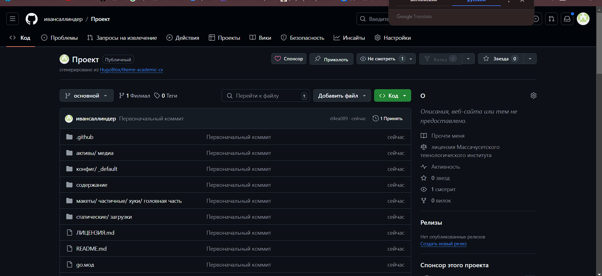
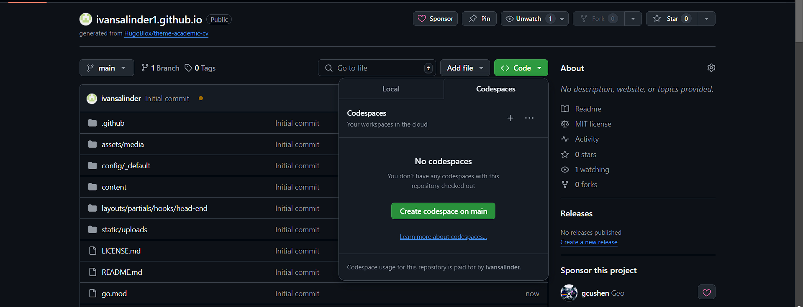
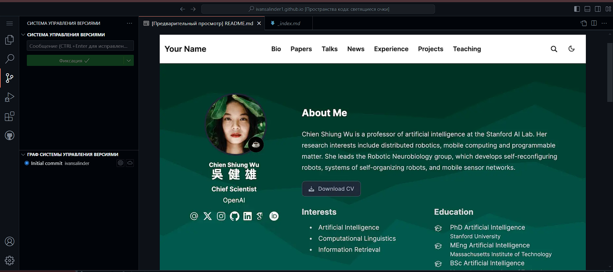
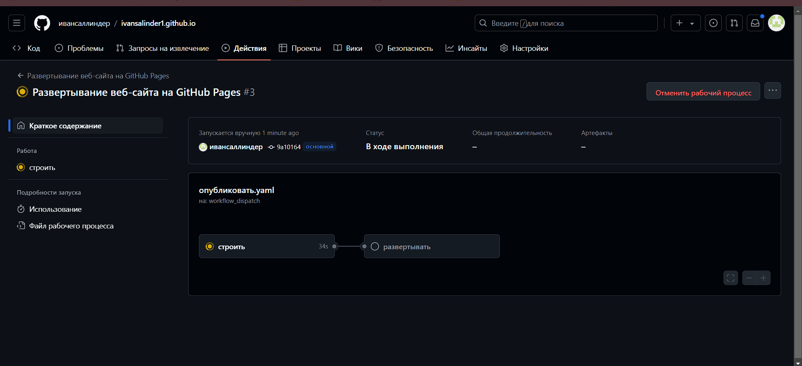
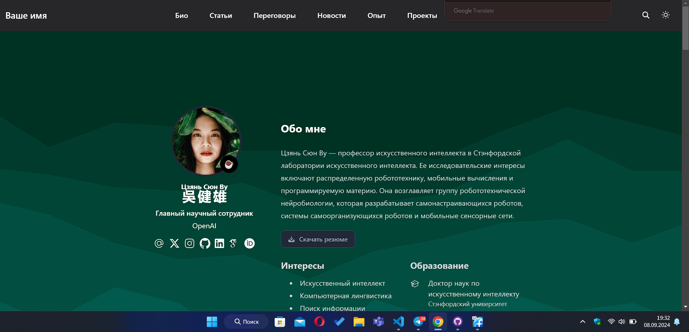

---
## Front matter
lang: ru-RU
title: Структура научной презентации
subtitle: Проект этап 1
author:
  - Салиндер Иван.
institute:
  - Российский университет дружбы народов, Москва, Россия
date: 15 марта 2024

## i18n babel
babel-lang: russian
babel-otherlangs: english

## Formatting pdf
toc: false
toc-title: Содержание
slide_level: 2
aspectratio: 169
section-titles: true
theme: metropolis
header-includes:
 - \metroset{progressbar=frametitle,sectionpage=progressbar,numbering=fraction}
 - '\makeatletter'
 - '\beamer@ignorenonframefalse'
 - '\makeatother'
---

# Информация

## Докладчик

:::::::::::::: {.columns align=center}
::: {.column width="70%"}

  * Салиндер Иван
  * НММ-01-23
  * студент
  * Российский университет дружбы народов
  * https://github.com/ivansalinder/study_2023-2024_os-intro

:::
::: {.column width="30%"}

# 
-  Цель работы

Создание сайта

:::
::::::::::::::

:::
::: {.column width="30%"}

#
Скачиваю необходимый шаблон и создаю шаблонный репозиторий для будущего сайта. 

:::
::: {.column width="30%"}

#
Открываю репозиторий на интерактивном окне для редактирования

:::
::: {.column width="30%"}

#
Проверяю отображение и работу сайта.
.

:::
::: {.column width="30%"}

#
Запускаю рабочий процесс

:::
::: {.column width="30%"}

#
Перехожу по ссылке и смотрю работу сайта в интернете

:::
::: {.column width="30%"}

# 
- Вывод

  Входе лабораторной работы я получил навыки создания сайта с помощью шаблонов маркдаун.
:::